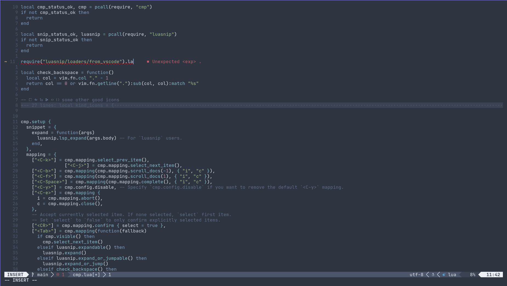

# Neovim Config

## Preview




## Installation

### Installing neovim nightly
First off you have to use the nightly release of neovim which you can get by doing: 
```bash
paru -S neovim-nightly-bin
```
### Dependencies
To install the dependencies from the aur you can do the following command:
```bash
paru -S xclip nodejs packer lua ranger python3 stylua rustup eslint autopep8 fixjson
```

### Saving Old Config
If you already have a neovim config for can save it by doing:
```bash 
mv ~/.config/nvim/ ~/.config/nvim-old
```

### Adding Config
To clone the Git repo into you config you can do:
```bash 
git clone https://github.com/Wolfdesroyer8/Neovim-Config.git ~/.config/nvim/
```

## Setup
### Markdown Preview
Do the following command to fix markdown preview:
```bash
cd ~/.local/share/nvim/site/pack/packer/start/markdown-preview.nvim/
yarn install
```
### Rust
Do the following commands for rust formatting:
```bash
rustup default nightly
```
